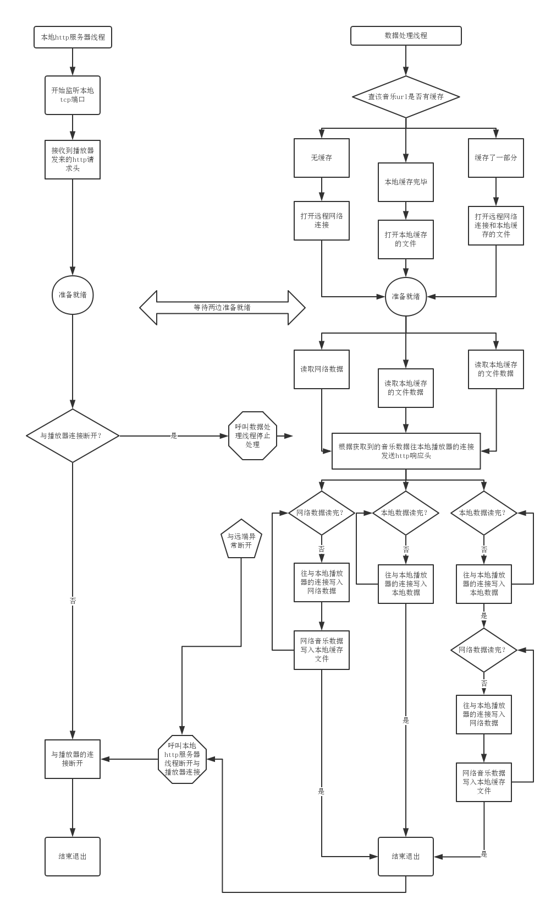

# 问题提出

网络音乐资源：http://fdfs.xmcdn.com/group14/M0A/70/9A/wKgDY1c8Yqyw9y0SABn_YcHTKjM567.mp3
如何做到边播边缓存？断点缓存？

## 存在以下问题：
+ 系统音乐播放器并没有提供缓存的接口，形如 `mediaPlayer.cacheDir(myCacheFile); [mediaPlayer cacheDir:myCacheFile]`

## 可以做到什么：
+ 系统音乐播放器提供`mediaPlayer.setUrl(myMusicUrl) [mediaPlayer setUrl:myMusicUrl]`接口，直接播放网络资源，系统完成网络请求和mp3文件的解码。
+ 系统音乐播放器提供`mediaPlayer.setPlayFile(myMusicFile)  [mediaPlayer setPlayFile:myMusicFile]`接口，播放本地文件，系统完成mp3文件的解码。

# 解决方案拟定

1. 使用第三方网络库下载远程音乐文件到本地，让播放器读取。

    优点：**操作简单，容易实现**

    缺点：**网络慢时，锁机制实现困难**

---
2. 自搭建本地http服务器让播放器访问，第三方网络库下载音乐并保存，把音乐数据以http协议形式传输给播放器。

    优点：**稳定可靠**

    缺点：**编程稍显复杂和困难**

```
注：如何搭建本地http服务器？
    1、http是基于tcp的协议，使用tcp socket监听本地的一个端口，例如60000。即本地socket通信。
    自解析http数据包，即搭建本地http服务器。由于是简易http服务器，不必完整实现http协议，只需要
    实现一小部分的解析即可。

    如何让播放器访问到本地http服务器？
    1、http://127.0.0.1:6000 设置此类url给播放器会连接本地http服务端6000。
```

**所以我们选择方法二来实现音乐缓存功能**

# 系统运行流程图

`此处画出两个线程运行的流程图来说明运行过程。`



# 注意事项
```
1. 音乐缓存文件命名以md5+Base64编码命名。
2. 音乐缓存文件有自定义文件头，记录下mp3文件应有的长度。
3. 本地http服务器和数据处理服务器，当自己的连接断开时，同时去断开对方的连接。要死一起死。
```


